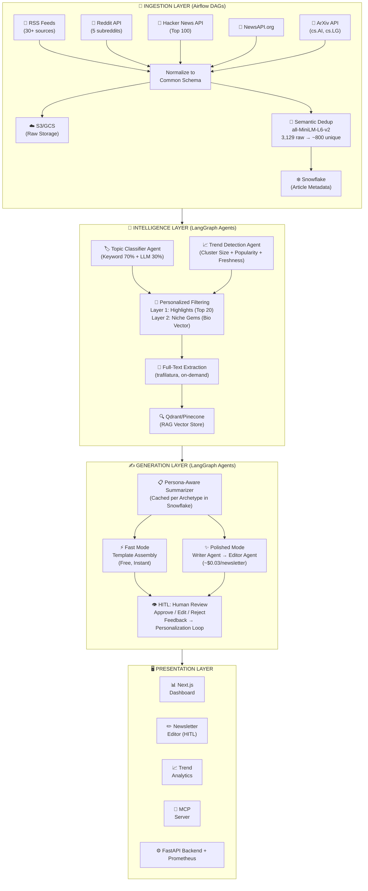
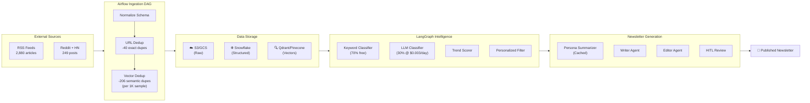
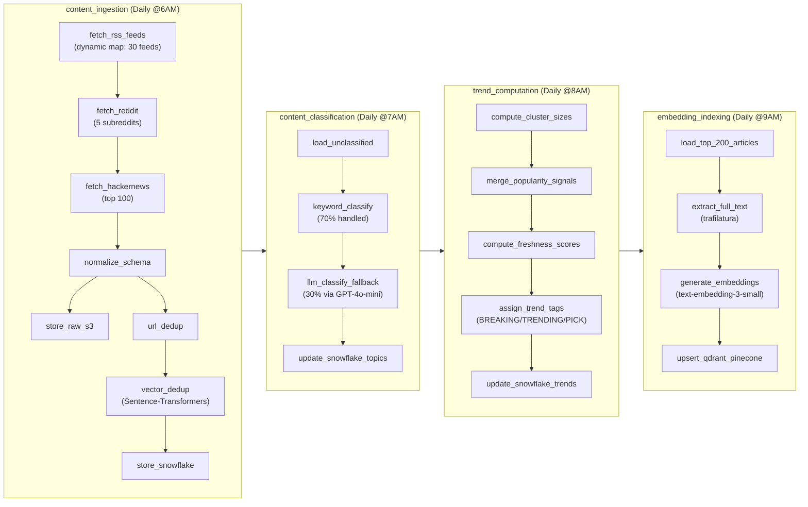

# Final_Project_Proposal# Final Project Proposal

## DAMG 7245 — Big Data and Intelligent Analytics

---

### Team Members

- Aakash Belide
- Abhinav Singh
- Rahul Bothra

### Attestation (Required)

WE ATTEST THAT WE HAVEN'T USED ANY OTHER STUDENTS' WORK IN OUR ASSIGNMENT AND ABIDE BY THE POLICIES LISTED IN THE STUDENT HANDBOOK.

- Aakash Belide: 33.3%
- Abhinav Singh: 33.3%
- Rahul Bothra: 33.3%

---

## 1. Title

**CurateAI — Real-Time Content Intelligence Engine for Personalized Newsletters & Enterprise SEO Strategy**

---

## 2. Introduction

### 2.1 Background

The newsletter economy has exploded — platforms like Substack, Beehiiv, and ConvertKit host hundreds of thousands of creators, and email marketing delivers $36–$42 return per dollar spent. Yet the production bottleneck has never been distribution; it has always been the curation and writing workflow. Newsletter creators typically spend 5–10 hours per issue scanning dozens of websites, reading articles, deciding what matters, and synthesizing insights. At the same time, professionals who subscribe to 10–20 newsletters still miss important developments because no single newsletter covers their exact niche interests.

The core challenge is twofold. On the creator side, relevant content is fragmented across RSS feeds, social platforms like Reddit and Hacker News, research repositories like ArXiv, and mainstream tech publications — each with different formats, update cadences, and signal-to-noise ratios. No existing tool aggregates, deduplicates, classifies, and ranks all of this into a coherent intelligence feed. On the reader side, newsletters are one-size-fits-all. A machine learning researcher and a venture capitalist both subscribing to the same AI newsletter receive identical content, even though their interests diverge significantly.

Existing AI newsletter tools (Newsblocks, Jenova, ProCurator) address only the writing step — they take a topic and generate text. None of them build a continuously updated data pipeline that ingests thousands of articles daily, detects cross-source trends, performs semantic deduplication, and generates personalized newsletters grounded in retrieved evidence with full source traceability.

### 2.2 Objective

The objective of this project is to build CurateAI, a cloud-native content intelligence platform that continuously ingests content from 30+ sources, applies semantic deduplication and trend detection at scale, and uses a multi-agent LLM system to generate personalized, citation-backed newsletters — all powered by big-data pipelines, RAG, and a polished user-facing dashboard.

We aim to deliver across four key areas:

**Big Data Engineering Component:** End-to-end ingestion of 3,000+ articles daily from RSS feeds, Reddit, Hacker News, and NewsAPI. Semantic vector-based deduplication using Sentence-Transformers. Topic classification via a hybrid keyword + LLM pipeline. Trend detection through cross-source cluster analysis. All data stored and indexed in Snowflake with S3 for raw storage and Qdrant/Pinecone for vector search.

**Significant LLM Use:** A LangGraph multi-agent system coordinating classification, trend analysis, persona-aware summarization, editorial synthesis (Writer Agent), and guardrail enforcement (Editor Agent). RAG-powered newsletter generation grounded in retrieved article evidence with inline citations. Persona-first caching strategy that scales LLM costs with archetypes, not user count.

**Cloud-Native Architecture:** Airflow for pipeline orchestration, Snowflake for structured data, S3/GCS for raw storage, Qdrant/Pinecone for vector search, Docker Compose for containerization, and cloud deployment via GCP Cloud Run or AWS ECS.

**User-Facing Application:** A Next.js dashboard with two distinct interfaces. B2C users configure interest profiles, browse content feeds, and review AI-generated newsletter drafts via HITL workflow. B2B company users access an SEO Intelligence Dashboard with trending topic opportunity cards, keyword velocity charts, and AI-generated content briefs. An MCP server enables Claude Desktop integration for both streams.

**B2B SEO Intelligence Layer (NEW):** A second product stream on the same data pipeline serving content creators and companies. Company authority profiles are vectorized and matched against trending topics to identify "Blue Ocean" content opportunities. A 4-signal opportunity scoring algorithm (relevance + velocity + saturation + competition) ranks topics by ROI potential. SpaCy NER-powered keyword velocity tracking detects surging technical entities. A Content Brief Generator Agent produces company-specific, RAG-powered SEO strategies with Pydantic-enforced structured output.

---

## 3. Project Overview

### 3.1 Scope

**In-Scope:**

**Data Sources:** 30+ RSS feeds from major tech publications (TechCrunch, The Verge, Wired, Ars Technica, VentureBeat, MIT Technology Review, IEEE Spectrum, Bloomberg Technology, BBC Tech, NYT Tech), AI-specific blogs (OpenAI, Google DeepMind, Hugging Face, NVIDIA, Microsoft Research, Simon Willison, Lil'Log), research feeds (ArXiv cs.AI, ArXiv cs.LG), social platforms (Reddit — r/MachineLearning, r/artificial, r/technology, r/LocalLLaMA, r/programming; Hacker News top/new stories), and NewsAPI.org aggregated headlines. Validated throughput: 3,129 raw articles per ingestion cycle.

**ETL Pipelines:** Automated multi-source ingestion via Airflow DAGs, full-text extraction with trafilatura (85%+ success rate validated), semantic deduplication using Sentence-Transformer vectors (`all-MiniLM-L6-v2`), hybrid topic classification (keyword-first with LLM fallback), and batch embedding generation for the vector store.

**LLM Components:** LangGraph multi-agent system with 7 agents: Topic Classifier Agent, Trend Detection Agent, Persona-Aware Summarizer Agent, Writer Agent (editorial synthesis), Editor Agent (guardrails), SEO Opportunity Agent (company-topic matching + scoring), and Content Brief Generator Agent (RAG-powered SEO strategy). RAG over the article corpus via Qdrant/Pinecone hybrid search. SpaCy NER (`en_core_web_sm`) for dynamic entity discovery and keyword velocity tracking.

**Cloud Infrastructure:** Snowflake (structured storage), S3/GCS (raw articles), Qdrant/Pinecone (vector index), Airflow (orchestration), FastAPI (backend), Next.js (frontend), Docker Compose (deployment).

**Guardrails & HITL:** Editor Agent validates citations, detects hallucinated claims, and enforces tone consistency. Pydantic schema enforcement on all agent outputs. Human editors review, edit, and approve newsletter drafts before publishing. User feedback (thumbs up/down, article swaps) feeds back into personalization scoring.

**Evaluation Strategy:** Classification accuracy on labeled test set, deduplication precision/recall, newsletter quality via LLM-as-judge rubric, citation accuracy rate, per-newsletter cost tracking, and end-to-end pipeline latency.

**Out-of-Scope:** Real-time push notifications, paid subscription/billing integration, email delivery infrastructure (Mailchimp/SendGrid integration), and podcast transcript ingestion.

### 3.2 Stakeholders / End Users

**Primary Users (B2C):** Individual professionals who want a personalized daily briefing on their specific areas of interest within AI and tech. Newsletter creators who want to automate their research and curation workflow.

**Primary Users (B2B):** Content teams at tech companies seeking SEO-optimized content opportunities matched to their domain authority. Startup founders and developer advocates who publish technical blogs and need to identify trending topics in their niche before competitors. Independent tech writers seeking data-driven content strategy.

**Secondary Stakeholders:** Engineering managers tracking industry trends. Research teams monitoring preprint servers. Marketing teams evaluating content investment priorities.

---

## 4. Problem Statement

### 4.1 Current Challenges

**Content Fragmentation:** Relevant information is scattered across 30+ sources with different formats (RSS, APIs, HTML), update frequencies (hourly to weekly), and signal-to-noise ratios. No unified system aggregates and normalizes all of this.

**Manual Curation Burden:** Newsletter creators spend 5–10 hours per issue on research, reading, and writing. This leads to creator burnout (62% of content creators report burnout according to a 2025 Tubefilter study) and inconsistent publishing schedules.

**Duplicate Coverage:** The same story gets covered by multiple outlets with different headlines. Without semantic deduplication, a content feed is 20–30% redundant (validated in our prototype: TF-IDF caught only 119 duplicates while Sentence-Transformer vectors caught 206 from a 1,000-article sample — a 73% improvement).

**No Personalization:** Existing newsletters deliver identical content to all subscribers regardless of their role, expertise level, or specific interests. A security researcher and a venture capitalist have fundamentally different information needs.

**LLM Cost at Scale:** Naively generating a unique newsletter for every user creates O(users × articles) LLM calls — financially unsustainable beyond a handful of users.

**Trend Blindness:** A single LLM prompt cannot compute cross-source trend signals. Detecting that a topic appeared in 8 sources within 24 hours (vs. its usual 2) requires continuous data ingestion and historical comparison — a data pipeline problem, not a prompt engineering problem.

**SEO Content Timing Gap:** When authoritative publications (ArXiv, TechCrunch, MIT News) start writing about a topic, that topic will start ranking on Google within 1–2 weeks. Companies that publish content about trending topics early — before search saturation — gain significant SEO advantage. But no existing tool connects real-time publication trend data to company-specific content strategy. Content teams either react too late (topic already saturated) or chase irrelevant trends (topic doesn't match their domain authority).

**Generic SEO Tooling:** Existing SEO tools (Ahrefs, SEMrush) analyze search data retrospectively — they show what's already ranking. None analyze what authoritative sources are publishing right now to predict what will rank next. This creates a blind spot for proactive content strategy.

### 4.2 Opportunities

CurateAI introduces a dual-stream content intelligence platform serving both consumers and enterprises from a single data pipeline. For B2C users: a unified, semantically deduplicated pipeline processing 3,000+ articles daily; automated cross-source trend detection; dual-layer personalization (Highlights + Niche Gems); persona-first caching reducing LLM costs by 98%; and HITL editorial workflow. For B2B users: company authority vectorization matched against trending topics using a 4-signal opportunity scoring algorithm; SpaCy NER-powered keyword velocity tracking detecting surging entities before they peak; and a Content Brief Generator Agent producing company-specific SEO strategies with structured Pydantic output. Same pipeline, two products — the architectural elegance of one engine serving two distinct value propositions.

---

## 5. Methodology

### 5.1 Data Sources

All data sources have been validated through prototyping. No sources require scraping — all use official APIs or open feed protocols.

**1. RSS Feeds (30+ Sources)**

Validated sources include TechCrunch, The Verge, Ars Technica, WIRED, VentureBeat, MIT News AI, Google AI Blog, OpenAI Blog, Google DeepMind, Hugging Face Blog, Lil'Log, MIT Technology Review, IEEE Spectrum, Simon Willison's Weblog, ArXiv cs.AI, ArXiv cs.LG, Hacker News RSS, BBC Technology, TechCrunch AI, AWS Machine Learning Blog, HackerNoon AI, Bloomberg Technology, NYT Technology, Google AI Research Blog, NVIDIA Technical Blog, and Microsoft Research Blog.

Data Format: XML/Atom parsed via `feedparser`, normalized to a unified JSON schema.
Validated Volume: 2,880 articles per ingestion cycle from RSS alone.
Validated Latency: Average feed fetch time 0.16–1.26 seconds per feed.

**2. Social & Community Signals**

Reddit API (5 subreddits): r/MachineLearning (26% post retention after quality filter), r/artificial (36%), r/technology (100%), r/LocalLLaMA (100%), r/programming (38%). Hacker News API: 99% success rate on top 100 stories, average score 211, average 107 comments per story.

Data Format: JSON via official APIs.
Validated Volume: 249 social posts per cycle (after quality filtering).
Total Combined Volume: 3,129 raw articles per ingestion cycle.

**3. Full-Text Article Content**

Extracted on-demand for top-ranked articles using `trafilatura`.
Validated Success Rate: 85% across all sources (23/27 sources at 100%; Bloomberg, NYT, OpenAI, and VentureBeat blocked — graceful fallback to RSS summary).
Validated Latency: Average <0.4 seconds per article extraction.
Average Article Length: 500–3,000 words for successful extractions.

**4. Embedding & Vector Index**

Sentence-Transformer embeddings (`all-MiniLM-L6-v2`) for deduplication and personalization.
OpenAI `text-embedding-3-small` for RAG vector store.
Expected Volume: 800–1,000 unique articles per day after dedup → 30,000+ embedded articles per month in Qdrant/Pinecone.

**Justification of Scale:** 3,129 articles per ingestion cycle, running daily, produces ~90,000 raw articles per month. After dedup, ~25,000–30,000 unique articles per month flow into Snowflake and the vector store. Over a semester of operation, this grows to 100,000+ indexed articles — a genuinely large-scale corpus requiring efficient storage, retrieval, and analytics infrastructure.

### 5.2 Technology Stack

| Layer | Technology | Justification |
| :--- | :--- | :--- |
| **Cloud** | GCP (primary) / AWS (secondary) | Free student credits, Cloud Run for serverless deployment |
| **Storage (Structured)** | Snowflake | Scalable columnar warehouse for article metadata, user profiles, analytics queries, temporal trend computation |
| **Storage (Raw)** | S3 / GCS | Raw article snapshots, RSS feed dumps, pipeline artifacts |
| **Vector Store** | Qdrant / Pinecone | Qdrant: open-source, self-hosted in Docker, fast HNSW indexing, REST + gRPC APIs, handles 100K+ vectors easily. Pinecone: managed alternative for production fallback with serverless tier |
| **NER / Entity Discovery** | SpaCy (`en_core_web_sm`) | Dynamic entity extraction (ORG, PRODUCT) for keyword velocity tracking; no hardcoded entity lists needed |
| **Embeddings (Dedup)** | Sentence-Transformers (`all-MiniLM-L6-v2`) | Local inference, zero API cost, fast (~2.5s for 1,000 titles on CPU) |
| **Embeddings (RAG)** | OpenAI `text-embedding-3-small` | Higher quality for retrieval, cost-effective at $0.02/1M tokens |
| **LLM Providers** | OpenAI GPT-4o (primary), GPT-4o-mini (classification/summarization), Claude 3.5 Sonnet (fallback) | Via LiteLLM multi-model router with daily budget cap |
| **Agent Framework** | LangGraph (StateGraph) | Deterministic agent routing with typed state, conditional branching, HITL interrupt support — proven in our PE Org-AI-R project |
| **Orchestration** | Apache Airflow | DAG-based scheduling for daily ingestion, embedding, trend computation; TaskFlow API with dynamic task mapping |
| **API** | FastAPI | High-performance async Python API with Pydantic validation |
| **Frontend** | Next.js 15 (App Router) + Tailwind CSS | Dashboard, newsletter editor, HITL workflow, trend visualizations |
| **MCP** | MCP SDK (SSE transport) | Claude Desktop integration for natural-language queries against the intelligence engine |
| **Observability** | Prometheus | Counters for agent calls, API latency, token usage, pipeline metrics |
| **CI/CD** | GitHub Actions | Automated testing, linting, container builds on every commit |
| **Deployment** | Docker Compose + Cloud Run | Multi-container stack with Nginx reverse proxy |

**Tool Selection Rationale — Alternatives Considered:**

Snowflake vs. PostgreSQL: PostgreSQL is simpler but Snowflake provides columnar analytics, native semi-structured data support (VARIANT type for article metadata), and scales to the 100K+ article corpus without manual indexing. The course also emphasizes cloud data warehousing.

Qdrant vs. Pinecone vs. ChromaDB: Qdrant offers the best balance — open-source, self-hosted in Docker (zero managed-service cost), supports both dense and sparse vectors, has native filtering, and handles 100K+ documents efficiently with HNSW indexing. Pinecone is a managed alternative if we need serverless scaling but introduces vendor dependency. ChromaDB is simpler but lacks the filtering and performance characteristics needed for our dual-layer personalization queries.

LangGraph vs. Autogen vs. CrewAI: LangGraph provides explicit StateGraph control with typed state dictionaries and conditional edge routing — essential for our branching workflow (Fast Mode vs. Polished Mode). Autogen's GroupChat pattern is more rigid. CrewAI abstracts away too much control. Our team has LangGraph experience from the PE Org-AI-R project.

Sentence-Transformers vs. OpenAI Embeddings for Dedup: Dedup runs on every article (3,000+/day). Using OpenAI embeddings would cost ~$0.06/day — trivial, but Sentence-Transformers run locally with zero cost and lower latency (~2.5s for 1,000 titles). We reserve OpenAI embeddings for the higher-quality RAG retrieval step where accuracy matters more.

### 5.3 Architecture

**System Architecture Overview:**

The platform follows a four-layer architecture: Ingestion Layer → Intelligence Layer → Generation Layer → Presentation Layer.

#### System Architecture Diagram



#### Data Flow Diagram (DFD)



#### Prototype-Validated Metrics (Infographics)

The following visualizations are generated from our prototype benchmark data:

**Figure 1 — Data Ingestion Funnel:**
Shows the complete data reduction pipeline from 3,129 raw articles to the final clean corpus, with percentage reduction at each stage.


**Figure 2 — Deduplication: TF-IDF vs Sentence-Transformer Vectors:**
Side-by-side comparison proving our architectural decision. Vectors catch 73% more semantic duplicates than keyword-based TF-IDF.


**Figure 3 — Full-Text Extraction Success Rate by Source:**
Validates trafilatura reliability across all 22+ sources. 82% of sources extract at 100%; 4 paywalled sources (Bloomberg, NYT, OpenAI, VentureBeat) fail gracefully with RSS summary fallback.


**Figure 4 — Article Volume by RSS Feed Source:**
Shows the distribution of articles across our 25+ feed sources, with ArXiv and OpenAI Blog contributing the highest volumes.


**Figure 5 — Full-Text Extraction Latency by Source:**
Validates that extraction meets our <0.4s target for the majority of sources. Only NVIDIA Blog (1.8s) and Microsoft Research (0.8s) exceed the threshold.


**Figure 6 — Social Platform Metrics (Reddit + Hacker News):**
Left: Post quality retention rate after filtering (r/technology and r/LocalLLaMA at 100%). Right: Community engagement signals on log scale (r/technology dominates in upvotes, HN in discussion depth).


**Figure 7 — LLM Cost Scaling: Per-User vs Persona-First Cache:**
The critical scalability proof. Per-user generation costs scale linearly (O(n)), while persona-first caching remains flat regardless of user count — achieving 98% cost savings at 10,000 users.


**Figure 8 — Dual-Layer Personalization: Highlights + Niche Gems:**
Validates that different personas receive meaningfully different content. Only 20% overlap in the Niche Gems section between Researcher and Investor profiles.


### 5.4 Data Processing & Transformation

**Batch Processing:** The core pipeline runs daily via Airflow. Three DAGs handle the workload: `content_ingestion` (fetches from all sources, normalizes, deduplicates), `content_classification` (topic tagging via hybrid keyword/LLM), and `trend_computation` (cluster analysis, scoring, tag assignment).

**Data Formats:** Raw sources arrive as XML (RSS), JSON (Reddit API, HN API, NewsAPI), and HTML (full-text extraction). All are normalized to a common JSON schema with fields: `id`, `title`, `summary`, `source_name`, `source_type`, `source_url`, `published_at`, `author`, `raw_categories`, `content_type`, `popularity_signal`, `full_text`, `ingested_at`. Processed data is stored as structured rows in Snowflake.

**Storage Schemas:** Snowflake tables include `articles` (core metadata + topic + trend score), `story_clusters` (dedup clusters with editorial density), `user_profiles` (interests, watchlist, archetype), `newsletter_history` (generated outputs with cost tracking), `summary_cache` (persona-cached summaries per article per archetype), and `user_feedback` (HITL signals for personalization tuning).

**Parallel Processing Strategy:** Airflow dynamic task mapping (`.expand()`) enables per-source parallel ingestion. Embedding generation is batched (100–500 articles per request). Persona-aware summarization is parallelized across archetypes using `asyncio.gather`.

**Embedding Generation:** Two embedding models serve different purposes. Sentence-Transformers (`all-MiniLM-L6-v2`) runs locally for deduplication — zero cost, ~2.5 seconds for 1,000 titles. OpenAI `text-embedding-3-small` is used for the RAG vector store where retrieval quality matters more — ~$0.02 per 1M tokens.

### 5.5 LLM Integration Strategy

LLMs are used at four distinct points in the pipeline, each with a specific role and cost profile:

**1. Topic Classification (LLM Fallback):** When the keyword classifier cannot confidently assign a category, GPT-4o-mini classifies the article from its title + summary. Structured JSON output: `{category, confidence}`. Cost: ~30% of articles × ~100 tokens each = negligible ($0.003/day).

**2. Persona-Aware Summarization:** For each unique article in a user's filtered set, the Summarizer Agent generates a persona-tailored summary. A VC receives a summary emphasizing market implications; a researcher receives one emphasizing methodology. Summaries are cached per archetype in Snowflake — if 5 VCs all receive the same article, only one LLM call is made. Cost scales with `unique_articles × archetypes`, not `unique_articles × users`.

**3. Writer Agent (Polished Mode):** Takes pre-cached summaries and produces an editorial synthesis — adding a thematic intro, grouping related stories, writing transitions, and adding a closing perspective. Since summaries are pre-written, this is a lightweight generation call (~300–400 tokens output). Cost: ~$0.01–0.02 per newsletter.

**4. Editor Agent (Guardrails):** Reviews the Writer Agent's output against source articles. Returns structured JSON: `{overall_quality, issues[], citation_check, revised_draft}`. Catches hallucinations, broken citations, unsupported claims, and tone mismatches. Cost: ~$0.02 per newsletter.

**RAG Pattern:** The Writer Agent retrieves full-text articles from Qdrant/Pinecone to ground its synthesis in actual source content. Hybrid retrieval (dense + keyword) ensures both semantic and exact-term matches.

**API Usage Pattern:** FastAPI `/generate-newsletter` triggers the full LangGraph workflow. The StateGraph routes through: Classification → Trend Detection → Personalized Filtering → Summarization → [Branch] Fast/Polished → HITL.

**Total LLM Cost per Newsletter:** $0.07–0.11 (Polished Mode) or ~$0.01 (Fast Mode, summarization only).

**5. SEO Opportunity Agent (B2B):** Matches trending topics against company authority vectors using cosine similarity, then applies a 4-signal scoring algorithm: Relevance (40% weight — cosine similarity with expertise bonus for >0.45 match), Velocity (30% — cluster size dynamics with "Blue Ocean" detection for low-saturation/high-velocity topics), Competition Gap (30% — whether monopoly sources like NYT/TechCrunch have already covered it). Returns urgency tiers: HIDDEN GEM (≥85), ACT NOW (≥70), MONITOR (≥50), SKIP (<50). Cost: $0 (pure mathematical scoring, no LLM calls).

**6. Content Brief Generator Agent (B2B):** Takes a high-opportunity topic-company match and generates a structured SEO content brief via RAG. Retrieves relevant articles from the corpus + Reddit/HN community discussions. Uses GPT-4o-mini with Pydantic structured output (`ContentBrief` model) to produce: strategic angle tailored to company expertise, 3 suggested titles, article structure outline, 8–10 target SEO keywords, community questions to answer, and internal linking strategy. Cost: ~$0.05–0.10 per brief.

**7. SpaCy NER Velocity Engine (B2B):** Not an LLM agent but a critical NLP component. SpaCy `en_core_web_sm` dynamically discovers technical entities (ORG, PRODUCT, WORK_OF_ART) from article titles without hardcoded entity lists. The corpus is split into temporal windows (e.g., last 12h vs. previous 12h) to compute velocity surge percentages per entity. A whitelist ensures core brands (OpenAI, NVIDIA, etc.) are never missed. Entities appearing in 3+ sources with >50% velocity surge are flagged as SURGING. Cost: $0 (local SpaCy inference).

### 5.6 Guardrails & Human-in-the-Loop (HITL)

**Input Moderation:** User bio/interest profiles are validated via Pydantic schemas. Profanity and adversarial inputs are filtered before they reach the personalization engine.

**Output Validation:** All agent outputs conform to strict Pydantic models. The Editor Agent enforces: no claims without source citations, no statistics not present in source articles, tone consistency with the requested style (technical/executive/casual), and citation integrity (all `[N]` references map to real articles).

**Schema Enforcement:** Every agent returns structured JSON validated by Pydantic V2 models. Example: `EditorReport(overall_quality: Literal["pass", "needs_revision", "reject"], issues: list[EditorIssue], citation_check: CitationCheck, revised_draft: Optional[str])`.

**Safety Layers:** The Writer Agent prompt includes hard rules: "NEVER invent facts not in the provided articles. ALWAYS cite sources. If articles conflict, mention both perspectives." The Editor Agent independently verifies compliance.

**HITL Decision Loop:** After the Editor Agent passes or revises a newsletter, the human editor receives the draft in the Next.js editor interface. They can approve as-is, edit individual sections, swap articles in or out, or reject entirely with feedback. Rejection feedback is logged and used to improve prompts. Article-level feedback (thumbs up/down, swaps) feeds back into the personalization scoring weights over time.

### 5.7 Evaluations & Testing

**LLM Evaluation Framework:**

Classification accuracy: tested against a labeled golden set of 100 articles with manually assigned topics. Target: 80%+ for keyword-only, 90%+ for keyword + LLM fallback.

Deduplication precision/recall: validated by manually reviewing 50 clusters for false merges (precision) and 50 known-duplicate pairs for missed matches (recall). Prototype result: Sentence-Transformers caught 73% more duplicates than TF-IDF.

Newsletter quality: LLM-as-judge rubric scoring on dimensions of synthesis quality (does it connect stories thematically?), citation accuracy (do all references check out?), factual grounding (no hallucinated claims?), and readability. Scored 1–5 per dimension.

Editor Agent reliability: tested with intentionally corrupted newsletters (injected hallucinations, broken citations, tone violations). Target: 100% catch rate on high-severity issues.

**Unit Tests:** ETL pipeline (ingestion, normalization, dedup logic), API endpoints (all FastAPI routes), agent wrappers (each agent returns valid Pydantic models), and personalization scoring (known profiles produce expected article rankings).

**Integration Tests:** Full pipeline: source ingestion → dedup → classification → trend detection → personalization → generation → editor review. HITL workflow: draft generation → human edit → feedback storage.

**CI Pipeline (GitHub Actions):** Runs on every commit. Lints Python (ruff), validates Pydantic schemas, runs unit tests, builds Docker containers, and runs integration tests against a test Snowflake schema.

**Metrics:** Classification accuracy (%), dedup precision and recall (%), newsletter quality score (1–5 rubric), citation accuracy rate (%), editor false positive rate (%), end-to-end latency (seconds), tokens consumed per newsletter, cost per newsletter ($), and pipeline throughput (articles processed per minute).

### 5.8 Proof of Concept (POC)

All prototyping has been completed and validated. Key results:

**Data Ingestion (Prototypes 1–3):** Successfully ingested 3,129 articles from 30+ RSS feeds, 5 Reddit subreddits, and Hacker News in a single pipeline run. Feed fetch latency: 0.16–1.26 seconds. Full-text extraction via trafilatura: 85% success rate, <0.4 seconds per article.

**Semantic Deduplication (Prototypes 4–5):** Sentence-Transformer vector clustering reduced a 1,000-article sample to 794 unique stories (20.6% reduction), catching 73% more duplicates than TF-IDF (206 vs. 119). Example: "Nvidia releases new GeForce driver" and "New GeForce RTX 50 series drivers now available from Nvidia" were correctly merged by vectors but missed by TF-IDF.

**Topic Classification (Prototype 6):** Hybrid keyword + LLM strategy classifies 70% of articles at zero cost, with GPT-4o-mini handling the remaining 30% ambiguous cases.

**Trend Detection (Prototype 7):** Ranking score combining cluster size, popularity signal, and freshness successfully identified BREAKING, TRENDING, and COMMUNITY-PICK stories matching real-world trends.

**Personalization (Prototype 8):** Dual-layer filtering (Highlights + Niche Gems) produced distinct article sets for Researcher vs. Investor personas with only 20% overlap in the personalized Gems section.

**Newsletter Generation (Prototypes 9–10):** Persona-first caching validated — LLM costs scale with archetypes (not users). Two distinct persona-aware newsletters generated from the same day's data, with visibly different content selection, summarization style, and editorial framing.

**End-to-End Pipeline (Prototype 11):** Single-script execution: ingest 3,129 articles → filter → cluster → classify → score for 2 personas → summarize → generate 2 distinct newsletters. Total pipeline cost: <$0.50.

**SEO Authority Vectorization (Prototype S1):** Three test companies (VectorScale — AI infra, ShieldAI — cybersecurity, PayFlow — fintech) vectorized with clear semantic separation in embedding space. VectorScale↔ShieldAI similarity moderate (~0.45, both AI-adjacent), PayFlow distant (~0.25) — confirming meaningful differentiation.

**SEO Relevance Matching (Prototype S2):** Deep corpus scan of 1,000+ articles matched against company authority vectors. Each company received distinct top-5 topic recommendations with <40% inter-company overlap. VectorScale matched to vector DB and RAG topics; ShieldAI to vulnerability and LLM security topics; PayFlow to financial ML topics.

**SEO Opportunity Scoring (Prototype S3):** 4-signal "Blue Ocean" algorithm validated. Key innovation: low cluster size (1–2 sources) with high velocity is scored as a HIDDEN GEM opportunity, not penalized as obscure. High cluster size (>15) triggers a SATURATION penalty. Successfully identified differentiated high-ROI opportunities per company.

**SEO Content Brief Generation (Prototype S4):** GPT-4o-mini with Pydantic `ContentBrief` structured output generated company-specific briefs. Same trending topic produced three distinct strategic angles: VectorScale got a technical infrastructure angle, ShieldAI got a security implications angle, PayFlow got a financial use-case angle. Cost: <$0.10 per brief.

**Keyword Velocity via SpaCy NER (Prototype S5):** Dynamic entity discovery using SpaCy `en_core_web_sm` — no hardcoded entity lists. Temporal window splitting (12h vs. 12h) computes velocity surge percentages. Entities with 3+ mentions and >50% surge flagged as SURGING. Validated against real-world trends (top surging entities matched HN front page).

**SEO Master Dashboard (Prototype S6):** Unified pipeline producing B2C personalized feeds + B2B SEO dashboard with velocity table, opportunity scorecards, and live content briefs — all from a single `master_demo_pipeline.py` execution.

---

## 6. Project Plan & Timeline

### 6.1 Milestones

**Week 1 — Data Foundation & Pipeline Infrastructure**

M1 (Days 1–3): Data infrastructure setup. Snowflake schema creation (articles, clusters, user profiles, summary cache, newsletter history, feedback). S3/GCS bucket configuration. Migrate prototype JSON-based storage to Snowflake. Seed initial article corpus from prototype data.

M2 (Days 4–7): Airflow pipeline implementation. Wrap RSS ingestion, Reddit API, and HN API into Airflow DAGs with dynamic task mapping per source. Implement dedup DAG (URL pass → Sentence-Transformer vector clustering). Implement classification DAG (keyword classifier + LLM fallback). Implement trend computation DAG. Validate full daily pipeline runs end-to-end.

**Week 2 — LLM Agents, Backend & Frontend**

M3 (Days 8–11): LangGraph agent system. Implement StateGraph with 7 agents (Classifier, Trend Detector, Summarizer, Writer, Editor, SEO Opportunity Agent, Content Brief Generator). Implement persona-first caching in Snowflake. Build RAG pipeline. Implement Fast/Polished mode branching. Implement SpaCy NER velocity engine. Build SEO opportunity scoring algorithm (4-signal model). Add MCP server (6 tools: get_trending, generate_newsletter, search_articles, get_topic_trends, get_seo_opportunities, generate_content_brief).

M4 (Days 12–14): FastAPI backend + Next.js frontend. Backend endpoints: feed management, article browsing, user/company profile CRUD, newsletter generation trigger, HITL approve/edit/reject, trend analytics, SEO opportunity scoring, content brief generation, keyword velocity dashboard, cost tracking. Frontend: B2C pages (content dashboard, profile editor, newsletter editor with HITL, trend charts) + B2B pages (company onboarding, SEO opportunity cards with urgency tiers, keyword velocity sparklines, content brief viewer).

**Week 3 — Integration, Testing & Deployment**

M5 (Days 15–17): Integration and testing. Connect frontend to all backend endpoints. Unit tests for ETL, agents, API, personalization scoring. Integration tests for full pipeline. Golden-set evaluation for classification and newsletter quality. Editor Agent reliability testing with corrupted inputs.

M6 (Days 18–19): Deployment and observability. Docker Compose multi-container stack (Airflow, FastAPI, Next.js, Qdrant/Pinecone, Nginx). Prometheus counters for agent calls, token usage, API latency. Deploy to GCP Cloud Run or AWS ECS. Configure secrets and environment variables.

M7 (Days 20–21): Final polish and documentation. Prompt refinement based on eval results. Architecture diagram finalization. Codelab documentation. Video presentation recording. Final demo preparation.

### 6.2 Timeline

| Week | Mon | Tue | Wed | Thu | Fri | Sat | Sun |
| :--- | :--- | :--- | :--- | :--- | :--- | :--- | :--- |
| **1** | Snowflake setup | S3/GCS + schema | Data migration | Airflow ingestion DAG | Airflow dedup DAG | Airflow classify + trend DAGs | Pipeline E2E validation |
| **2** | LangGraph agents | RAG pipeline | Writer + Editor + MCP | FastAPI endpoints | Next.js dashboard | Frontend editor + HITL | Frontend trends + profiles |
| **3** | Frontend integration | Unit tests | Integration tests + evals | Docker + deploy | Prometheus + observability | Documentation + Codelab | Video + final demo |

---

## 7. Team Roles & Responsibilities

**Aakash Belide — ETL & Data Pipeline Lead**

Lead implementation of Airflow DAGs for multi-source ingestion, deduplication, classification, trend computation, and SEO velocity tracking. Manage Snowflake schema design (including `company_profiles` and `seo_opportunities` tables), data migration, and S3/GCS raw storage. Implement Sentence-Transformer vector clustering and company authority vectorization pipeline. Maintain embedding batch jobs and Qdrant/Pinecone index. Build and maintain evaluation datasets.

**Abhinav Singh — LLM Engineer & Agent Lead**

Design and implement the LangGraph StateGraph with all 7 agents (Classifier, Trend Detector, Summarizer, Writer, Editor, SEO Opportunity Agent, Content Brief Generator). Build the RAG pipeline. Implement persona-first caching, Fast/Polished branching, and the B2B SEO opportunity scoring algorithm (4-signal model). Build the SpaCy NER velocity engine. Build the MCP server. Design prompts, guardrails, and Pydantic schemas (including `ContentBrief`, `ContentStrategyReport`). Lead golden-set evaluation.

**Rahul Bothra — Backend, Frontend & Cloud Architect**

Build FastAPI backend with all REST endpoints (B2C newsletter + B2B SEO). Implement the Next.js 15 frontend with dual interfaces: B2C (dashboard, newsletter editor, HITL workflow) and B2B (company onboarding, SEO opportunity dashboard, keyword velocity charts, content brief viewer). Handle Docker Compose containerization and cloud deployment. Configure Nginx, Prometheus, and GitHub Actions CI/CD. Lead integration testing and demo preparation.

### Project Management

All task tracking and sprint planning is managed via **GitHub Projects Kanban Board** with the following columns: Backlog → In Progress → In Review → Done. Each milestone from Section 6.1 is broken into discrete GitHub Issues assigned to team members, with labels for priority (P0/P1/P2), component (pipeline/agents/frontend/infra), and week (W1/W2/W3).

---

## 8. Risks & Mitigation

### 8.1 Potential Risks

- RSS feed structure changes or feeds going offline
- API rate limits on Reddit, HN, or NewsAPI free tiers
- Full-text extraction blocked by paywalled/protected sites
- LLM hallucinations in newsletter generation
- High API cost if persona-caching logic fails or archetypes proliferate
- Slow pipeline runtime as article corpus grows
- Qdrant/Pinecone index degradation at scale
- Frontend development timeline overrun (most UI-heavy component, now with B2B pages)
- SpaCy NER missing important entities or flagging noise (common nouns misidentified as products)
- SEO content briefs producing generic strategies not differentiated per company
- Company authority vectors not separating well for companies in similar domains

### 8.2 Mitigation Strategies

- Feed monitoring with graceful degradation — if a feed fails, the pipeline continues with remaining sources and logs an alert
- Conservative API usage well within free tier limits (Reddit: 100 req/min, we use <10; NewsAPI: 100 req/day, we use <5)
- Fallback to RSS summary when trafilatura fails (validated: 4 sources blocked, all fall back cleanly)
- Editor Agent as a dedicated guardrail layer with Pydantic schema enforcement; hard rules in Writer prompt ("never invent facts")
- Daily budget cap on LLM spend via LiteLLM router (as implemented in PE Org-AI-R); limit archetypes to 5–7 maximum
- Airflow parallelism via dynamic task mapping; Snowflake handles analytical queries efficiently at 100K+ article scale
- Qdrant/Pinecone collection size monitoring; re-index monthly if needed
- Frontend fallback plan: if Next.js timeline slips, deploy B2C first, B2B SEO dashboard as stretch
- SpaCy entity filtering: minimum 3+ source appearances, whitelist for core brands, statistical significance threshold validated in Prototype S5
- Content brief quality: Pydantic `ContentBrief` schema enforcement ensures structured output; company expertise injected into prompt context
- Authority vector separation: validated in Prototype S1 with clear cosine similarity spread across 3 test companies

---

## 9. Expected Outcomes & Metrics

### 9.1 KPIs

| Metric | Target | How Measured |
| :--- | :--- | :--- |
| Daily article throughput | 3,000+ raw, 800+ unique after dedup | Airflow pipeline logs |
| Dedup improvement over TF-IDF | 70%+ more duplicates caught | Benchmark on labeled set |
| Classification accuracy (keyword) | ≥ 80% | Golden set of 100 labeled articles |
| Classification accuracy (keyword + LLM) | ≥ 90% | Golden set of 100 labeled articles |
| Persona overlap in Niche Gems | ≤ 20% | Cross-persona article set comparison |
| Newsletter quality score | ≥ 4.0 / 5.0 | LLM-as-judge rubric |
| Citation accuracy | ≥ 95% | Automated citation validation |
| Editor Agent catch rate (high-severity) | 100% | Corrupted-input test suite |
| Per-newsletter cost (Polished Mode) | ≤ $0.15 | Token tracking per generation |
| End-to-end pipeline latency | ≤ 5 minutes | Airflow task duration |
| Cost reduction vs. naive per-user generation | ≥ 95% | Persona-cache vs. direct comparison |
| Company topic match differentiation | < 40% overlap in top-5 | Cross-company recommendation comparison |
| SEO opportunity score intuitiveness | Manual review passes | Expert validation of top picks |
| Content brief company-specificity | 3 distinct angles for same topic | Side-by-side brief comparison |
| SpaCy NER entity precision | Top 3 surging entities verifiable | Cross-check with HN front page |
| Content brief cost | ≤ $0.10 per brief | Token tracking per generation |

### 9.2 Expected Benefits

**Technical Benefits:** Demonstrates a production-grade content intelligence pipeline with semantic NLP (vector dedup, embedding-based personalization), multi-agent LLM orchestration (5 LangGraph agents with conditional routing), and a novel persona-first caching architecture that solves the cost-scalability problem for LLM-generated content. Establishes a reusable pattern for any domain-specific newsletter (fintech, healthcare, climate) by swapping feed lists and topic taxonomies.

**Practical Benefits:** Reduces newsletter creation time from 5–10 hours to under 15 minutes (review and edit only). Delivers personalized content discovery — readers get both must-know stories (Highlights) and niche gems tailored to their specific role and interests. Provides content intelligence that no single LLM prompt can produce: cross-source trend detection, editorial density analysis, and temporal topic tracking.

---

## 10. Token & Cost Report (Required)

**Token Measurement:** Every LLM call is logged with prompt tokens, completion tokens, model used, agent name, and user archetype. Aggregated into Snowflake for reporting: tokens per agent, tokens per newsletter, tokens per archetype, total daily tokens, and total daily cost.

**Main Cost Drivers:** Persona-aware summarization is the largest cost component (~60% of total). Writer Agent synthesis is second (~20%). Editor Agent review is third (~15%). Classification fallback is negligible (~5%).

**Optimization Strategies:**

Persona-first caching: generate one summary per article per archetype, not per user. For a platform with 5 archetypes and 30 unique articles per day, that is 150 cached summaries — regardless of whether there are 10 users or 10,000. Validated: 98% cost reduction vs. per-user generation for a hypothetical 10,000-user platform.

Hybrid classification: keyword-first handles 70% of articles at zero LLM cost. Only 30% of ambiguous articles use GPT-4o-mini (~$0.003/day total).

LiteLLM budget cap: hard daily spend limit prevents runaway costs. GPT-4o-mini for summarization and classification; GPT-4o reserved for Writer Agent synthesis where quality matters most.

Fast Mode option: template-based assembly skips Writer + Editor agents entirely, reducing per-newsletter LLM cost to just the summarization step (~$0.01).

**Projected Monthly Cost:**

| Component | Daily Cost | Monthly Cost |
| :--- | :--- | :--- |
| Summarization (5 archetypes × 30 articles) | ~$0.30 | ~$9.00 |
| Writer Agent (10 newsletters/day, Polished) | ~$0.15 | ~$4.50 |
| Editor Agent (10 newsletters/day) | ~$0.20 | ~$6.00 |
| Classification fallback | ~$0.003 | ~$0.09 |
| Embeddings (text-embedding-3-small) | ~$0.02 | ~$0.60 |
| **Total** | **~$0.67** | **~$20.19** |

---

## 11. Conclusion

CurateAI addresses a genuine, widespread problem — the unsustainable manual effort required to create quality newsletters — with a solution that is deeply rooted in data engineering, not just LLM prompting. The platform's core value proposition is its intelligence pipeline: continuous multi-source ingestion of 3,000+ articles daily, semantic vector deduplication that catches 73% more duplicates than keyword methods, cross-source trend detection that identifies breaking stories before they peak, and dual-layer personalization that delivers both universal must-know content and niche discovery tailored to each reader's expertise.

The persona-first caching architecture solves the critical scalability challenge of LLM-generated content, reducing costs by 98% compared to per-user generation while maintaining personalization quality. The hybrid Fast/Polished mode gives users control over the cost-quality tradeoff, and the Editor Agent provides a robust guardrail layer with Pydantic-enforced structured outputs.

Every architectural decision in this proposal has been empirically validated through 11 prototypes, with data covering ingestion throughput (3,129 articles), dedup effectiveness (20.6% reduction via vectors), extraction reliability (85% success rate), personalization differentiation (20% persona overlap), and end-to-end cost (<$0.50 for 2 complete newsletters). The project is designed to be completed within 3 weeks by a team of 3, with clear role separation, a phase-by-phase timeline, and realistic scope boundaries.

---

## 12. References

**Data Sources:**
- RSS/Atom Protocol Specification — https://www.rssboard.org/rss-specification
- Reddit API Documentation — https://www.reddit.com/dev/api
- Hacker News API — https://github.com/HackerNews/API
- NewsAPI.org — https://newsapi.org/docs
- ArXiv API — https://arxiv.org/help/api
- OpenAlex API — https://docs.openalex.org

**Frameworks & Libraries:**
- LangGraph — https://langchain-ai.github.io/langgraph/
- Apache Airflow — https://airflow.apache.org/
- FastAPI — https://fastapi.tiangolo.com/
- Next.js — https://nextjs.org/
- Qdrant — https://qdrant.tech/documentation/
- Pinecone — https://docs.pinecone.io/
- Sentence-Transformers — https://www.sbert.net/
- LiteLLM — https://docs.litellm.ai/
- trafilatura — https://trafilatura.readthedocs.io/
- feedparser — https://feedparser.readthedocs.io/
- Pydantic V2 — https://docs.pydantic.dev/
- Prometheus Python Client — https://github.com/prometheus/client_python
- MCP SDK — https://modelcontextprotocol.io/

**Cloud & Infrastructure:**
- Snowflake Documentation — https://docs.snowflake.com/
- AWS S3 / GCS — https://aws.amazon.com/s3/ / https://cloud.google.com/storage
- Docker Compose — https://docs.docker.com/compose/
- GitHub Actions — https://docs.github.com/en/actions

**Research & Best Practices:**
- RAG Patterns — OpenAI Cookbook, LangChain Documentation
- Reciprocal Rank Fusion — Cormack et al., 2009
- Sentence-BERT — Reimers & Gurevych, 2019 (https://arxiv.org/abs/1908.10084)
- HyDE: Hypothetical Document Embeddings — Gao et al., 2022

---

## Appendix

### A. Prototype Validation Data

All prototype data and benchmark reports are available in the GitHub repository under `/prototyping/reports/`:

- `feed_analysis_report.csv` — Per-source RSS feed analysis (fetch time, item count, content availability)
- `extraction_report.csv` — Per-article full-text extraction results (success/failure, latency, character count)
- `extraction_source_report.csv` — Per-source extraction success rates and average content length
- `social_source_report.csv` — Reddit and HN API validation (success rates, latency, content metrics)
- `dedup_funnel_metrics.csv` — Deduplication pipeline funnel (raw → URL dedup → semantic dedup)
- `vector_funnel_metrics.csv` — Vector-based dedup performance metrics
- `ingestion_funnel_report.md` — Complete ingestion funnel analysis with architecture decision rationale

**B2B SEO Prototype Data** (available under `/SEO_Prototype/Data/`):
- `company_authority_vectors.json` — Vectorized company profiles with 384-dim embeddings
- `topic_company_matches.json` — Deep corpus relevance matching results per company
- `opportunity_scorecards.json` — 4-signal scored opportunity cards with urgency tiers
- `content_strategy_briefs.json` — Pydantic-validated content briefs per company
- `seo_velocity_report.json` — SpaCy NER entity velocity with surge percentages
- `seo_master_dashboard_report.json` — Consolidated B2B dashboard payload

### B. Architecture Decision: TF-IDF vs. Semantic Vectors

| Method | Unique Clusters (1K sample) | Duplicates Caught | Result |
| :--- | :--- | :--- | :--- |
| TF-IDF (Cosine > 0.65) | 890 | 110 | Missed semantic variants |
| Sentence-Transformers (`all-MiniLM-L6-v2`) | 794 | 206 | Caught 73% more duplicates |

Example: "Nvidia releases new GeForce driver" and "New GeForce RTX 50 series drivers now available from Nvidia" — TF-IDF treated these as different stories; vectors correctly merged them.

### C. Source Reliability Matrix

| Source | Extraction Success | Avg Latency | Notes |
| :--- | :--- | :--- | :--- |
| TechCrunch | 100% | 0.10s | Reliable |
| The Verge | 100% | 0.13s | Reliable |
| ArXiv | 100% | 0.08s | Reliable |
| MIT Tech Review | 100% | 0.12s | Reliable |
| Hacker News | 99% | 19.9s (100 stories) | Reliable |
| Bloomberg | 0% | 0.18s | Blocked — fallback to RSS summary |
| NYT | 0% | 0.14s | Blocked — fallback to RSS summary |
| OpenAI Blog | 0% | 0.13s | Blocked — fallback to RSS summary |
| VentureBeat | 0% | 20.16s | Blocked — fallback to RSS summary |

### D. Sample Prompts

**Writer Agent (Polished Mode):**
```
You are an expert newsletter writer for the AI & Tech industry.

CONTEXT — Today's top articles (with pre-written summaries):
{formatted_article_summaries}

READER PROFILE:
- Archetype: {archetype_name}
- Style: {newsletter_style}

INSTRUCTIONS:
1. Write a 2-3 sentence editorial intro connecting today's biggest themes
2. Group the summaries into 2-3 thematic sections with compelling headlines
3. Add 1-sentence transitions between sections
4. End with a "Quick Hits" section for 2-3 smaller stories
5. Maintain inline citations [N] from the summaries
6. Total added text: 150-250 words (summaries are pre-written)
```

**Editor Agent:**
```
You are a strict editorial reviewer. Review this newsletter draft against
the source articles and return a JSON report with:
- overall_quality: "pass" | "needs_revision" | "reject"
- issues: [{type, location, description, severity, suggested_fix}]
- citation_check: {total_used, valid, broken, uncited_articles}
- revised_draft: corrected text if fixable
```

### E. LangGraph Agent Workflow (Mermaid)

```mermaid
stateDiagram-v2
    [*] --> Ingest: Daily Airflow Trigger

    state "Ingestion & Dedup" as Ingest {
        RSS_Fetch --> Normalize
        Reddit_Fetch --> Normalize
        HN_Fetch --> Normalize
        Normalize --> URL_Dedup
        URL_Dedup --> Vector_Dedup
        Vector_Dedup --> Store_Snowflake
    }

    Ingest --> Classify

    state "Classification" as Classify {
        Keyword_Check --> is_confident
        is_confident --> LLM_Classify: No (30%)
        is_confident --> Assign_Topic: Yes (70%)
        LLM_Classify --> Assign_Topic
    }

    Classify --> TrendDetect

    state "Trend Detection" as TrendDetect {
        Cluster_Size --> Compute_Score
        Popularity_Signal --> Compute_Score
        Freshness --> Compute_Score
        Compute_Score --> Assign_Tags
    }

    TrendDetect --> Personalize

    state "Personalization" as Personalize {
        Load_User_Profile --> Highlights
        Highlights: Layer 1 — Top 20 reordered
        Load_User_Profile --> NicheGems
        NicheGems: Layer 2 — Bio Vector matching
    }

    Personalize --> Summarize

    state "Summarization" as Summarize {
        Check_Cache --> Cache_Hit: Exists
        Check_Cache --> Generate_Summary: Miss
        Generate_Summary --> Store_Cache
        Cache_Hit --> Return_Summary
        Store_Cache --> Return_Summary
    }

    Summarize --> Mode_Select

    state "Generation Mode" as Mode_Select {
        state mode_choice <<choice>>
        mode_choice --> Fast: User selects Fast
        mode_choice --> Polished: User selects Polished

        state "Fast Mode" as Fast {
            Template_Assembly --> Fast_Output
        }

        state "Polished Mode" as Polished {
            Writer_Agent --> Editor_Agent
            Editor_Agent --> is_pass
            is_pass --> Polished_Output: Pass
            is_pass --> Writer_Agent: Needs Revision
        }
    }

    Mode_Select --> HITL

    state "Human-in-the-Loop" as HITL {
        Review_Draft --> Approve
        Review_Draft --> Edit
        Review_Draft --> Reject
        Edit --> Updated_Draft
        Reject --> Feedback_Log
    }

    HITL --> Publish
    Publish --> [*]
```



### F. Snowflake Schema Design

```sql
-- Core article metadata
CREATE TABLE articles (
    article_id      VARCHAR PRIMARY KEY,
    title           VARCHAR(1000),
    summary         TEXT,
    full_text       TEXT,
    source_name     VARCHAR(100),
    source_type     VARCHAR(20),    -- 'rss' | 'reddit' | 'hackernews'
    source_url      VARCHAR(2000),
    published_at    TIMESTAMP_NTZ,
    author          VARCHAR(500),
    raw_categories  VARIANT,        -- JSON array from source
    content_type    VARCHAR(50),
    popularity_signal INT,
    cluster_id      VARCHAR(100),
    topic_category  VARCHAR(100),
    topic_confidence FLOAT,
    classification_method VARCHAR(20), -- 'keyword' | 'llm'
    trend_score     FLOAT,
    trend_tag       VARCHAR(20),    -- 'BREAKING' | 'TRENDING' | 'COMMUNITY_PICK'
    ingested_at     TIMESTAMP_NTZ DEFAULT CURRENT_TIMESTAMP()
);

-- Semantic dedup clusters
CREATE TABLE story_clusters (
    cluster_id      VARCHAR PRIMARY KEY,
    representative_title VARCHAR(1000),
    cluster_size    INT,            -- editorial density
    source_list     VARIANT,        -- JSON array of source_names
    first_seen_at   TIMESTAMP_NTZ,
    last_seen_at    TIMESTAMP_NTZ
);

-- User profiles and preferences
CREATE TABLE user_profiles (
    user_id         VARCHAR PRIMARY KEY,
    display_name    VARCHAR(200),
    bio_text        TEXT,
    archetype       VARCHAR(50),    -- mapped to caching archetype
    topics_of_interest VARIANT,     -- JSON array
    topics_to_exclude  VARIANT,
    preferred_sources  VARIANT,
    entities_to_watch  VARIANT,
    newsletter_style   VARCHAR(50), -- 'technical' | 'executive' | 'casual'
    newsletter_mode    VARCHAR(20), -- 'fast' | 'polished'
    max_articles    INT DEFAULT 8,
    created_at      TIMESTAMP_NTZ DEFAULT CURRENT_TIMESTAMP()
);

-- Persona-cached summaries (scales with archetypes, not users)
CREATE TABLE summary_cache (
    cache_id        VARCHAR PRIMARY KEY,
    article_id      VARCHAR REFERENCES articles(article_id),
    archetype       VARCHAR(50),
    summary_text    TEXT,
    tokens_used     INT,
    model_used      VARCHAR(50),
    cost_usd        FLOAT,
    generated_at    TIMESTAMP_NTZ DEFAULT CURRENT_TIMESTAMP()
);

-- Newsletter generation history
CREATE TABLE newsletter_history (
    generation_id   VARCHAR PRIMARY KEY,
    user_id         VARCHAR REFERENCES user_profiles(user_id),
    generation_mode VARCHAR(20),    -- 'fast' | 'polished'
    articles_included VARIANT,      -- JSON array of article_ids
    highlights_count INT,
    gems_count      INT,
    total_tokens    INT,
    total_cost_usd  FLOAT,
    editor_verdict  VARCHAR(20),    -- 'pass' | 'needs_revision' | 'reject'
    editor_issues   VARIANT,        -- JSON array of issues
    final_markdown  TEXT,
    generated_at    TIMESTAMP_NTZ DEFAULT CURRENT_TIMESTAMP()
);

-- HITL feedback for personalization tuning
CREATE TABLE user_feedback (
    feedback_id     VARCHAR PRIMARY KEY,
    user_id         VARCHAR REFERENCES user_profiles(user_id),
    generation_id   VARCHAR REFERENCES newsletter_history(generation_id),
    article_id      VARCHAR,
    feedback_type   VARCHAR(20),    -- 'thumbs_up' | 'thumbs_down' | 'swapped_out'
    feedback_text   TEXT,
    created_at      TIMESTAMP_NTZ DEFAULT CURRENT_TIMESTAMP()
);
```

### G. Normalized Article JSON Schema

```json
{
    "$schema": "CurateAI Article Schema v1.0",
    "article": {
        "id": "uuid-v4",
        "title": "OpenAI Launches GPT-5 with Native Tool Use",
        "summary": "OpenAI announced GPT-5 today with built-in...",
        "full_text": null,
        "source_name": "techcrunch",
        "source_type": "rss",
        "source_url": "https://techcrunch.com/2026/04/01/...",
        "published_at": "2026-04-01T14:30:00Z",
        "author": "Kyle Wiggers",
        "raw_categories": ["AI", "OpenAI", "LLMs"],
        "content_type": "article",
        "popularity_signal": 0,
        "cluster_id": "cluster_gpt5_launch",
        "topic_category": "LLMs & Foundation Models",
        "topic_confidence": 0.95,
        "classification_method": "keyword",
        "trend_score": 87.5,
        "trend_tag": "BREAKING",
        "ingested_at": "2026-04-01T15:00:00Z"
    }
}
```

### H. Airflow DAG Structure (Mermaid)




### I. B2B SEO Prototype Code Snippets

**S1: Company Authority Vectorization**
```python
# Combine expertise + blog history for deep knowledge representation
full_context = company['expertise_description'] + " " + " ".join(company['existing_blog_topics'])
authority_vector = model.encode(full_context)  # 384-dim dense vector
# Verify: inter-company similarity matrix shows meaningful separation
sim_matrix = cosine_similarity(company_vectors)
```

**S3: Blue Ocean Opportunity Scoring Algorithm (4-Signal Model)**
```python
def calculate_opportunity_score(relevance, cluster_size, source_name):
    # Signal 1: Relevance Anchor (40% weight) — cosine sim with expertise bonus
    rel_score = min((relevance * 200), 100)
    if relevance > 0.5: rel_score += 15  # HIDDEN GEM bonus (95th percentile)
    
    # Signal 2: Velocity Dynamic (30% weight) — cluster size as momentum proxy
    if cluster_size == 1: vel_score = 65      # Seed opportunity
    elif 2 <= cluster_size <= 10: vel_score = 100  # THE SWEET SPOT
    else: vel_score = 30                       # SATURATED — Red Ocean
    
    # Signal 3: Competition Gap (30% weight) — source authority check
    monopoly_sources = ["TechCrunch", "Wired", "NYT", "VentureBeat"]
    comp_score = 20 if source_name in monopoly_sources else 95  # Blue Ocean
    
    return (rel_score * 0.4) + (vel_score * 0.3) + (comp_score * 0.3)
```

**S4: Content Brief Generator with Pydantic Structured Output**
```python
class ContentBrief(BaseModel):
    angle: str
    suggested_titles: List[str]
    suggested_structure: List[str]
    seo_keywords: List[str]
    community_questions: List[str]
    internal_linking_strategy: str

response = client.beta.chat.completions.parse(
    model="gpt-4o-mini",
    messages=[{"role": "user", "content": seo_prompt}],
    response_format=ContentBrief  # Pydantic-enforced structured output
)
```

**S5: SpaCy NER Dynamic Entity Discovery + Velocity Tracking**
```python
nlp = spacy.load("en_core_web_sm")
entity_counts = Counter()
for doc in nlp.pipe([a['title'] for a in corpus], batch_size=50):
    for ent in doc.ents:
        if ent.label_ in ["ORG", "PRODUCT", "WORK_OF_ART"]:
            entity_counts[ent.text.strip()] += 1

# Temporal velocity: split corpus into 12h windows
velocity = ((count_recent - count_previous) / count_previous) * 100
# Status: SURGING (>50%), STABLE (-20% to 50%), DECLINING (<-20%)
```

### J. B2B SEO Prototype File Manifest

| Prototype | Script | Purpose |
| :--- | :--- | :--- |
| S1: Authority Vectors | s1_authority_vector_test.py | Company profile vectorization + inter-company similarity validation |
| S2: Relevance Matching | s2_relevance_matching_test.py | Deep corpus scan (1000+ articles) matched against company vectors |
| S3: Opportunity Scoring | s3_opportunity_scoring_test.py | 4-signal Blue Ocean algorithm with HIDDEN GEM / ACT NOW tiers |
| S4: Content Briefs | s4_content_brief_test.py | Pydantic ContentBrief generation via GPT-4o-mini structured output |
| S5: Keyword Velocity | s5_keyword_velocity_test.py | SpaCy NER entity discovery + temporal velocity surge computation |
| S6: Dashboard Data | s6_master_dashboard_data.py | Consolidated B2B dashboard payload (velocity + opportunities + briefs) |
| Master Pipeline | master_demo_pipeline.py | Unified B2C + B2B execution producing complete demo report |
