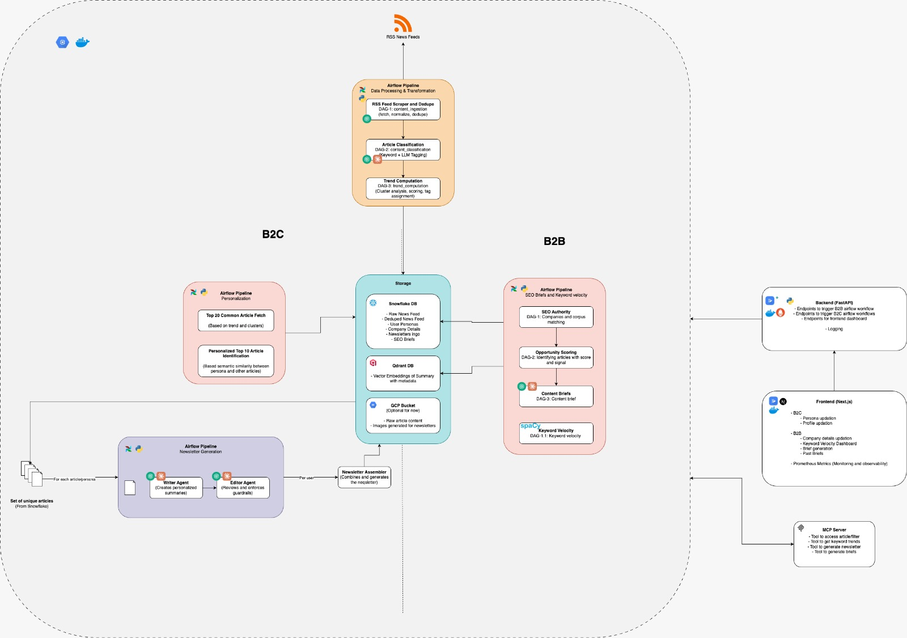
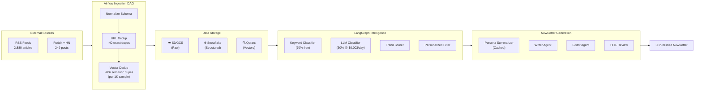

# Final Project Proposal

## DAMG 7245 — Big Data and Intelligent Analytics

---

### Team Members

- Aakash Belide
- Abhinav Kumar Piyush
- Rahul Bothra

### Attestation (Required)

WE ATTEST THAT WE HAVEN'T USED ANY OTHER STUDENTS' WORK IN OUR ASSIGNMENT AND ABIDE BY THE POLICIES LISTED IN THE STUDENT HANDBOOK.

- Aakash Belide: 33.3%
- Abhinav Kumar Piyush: 33.3%
- Rahul Bothra: 33.3%

### Video Presentation

[Project Video Walkthrough](https://drive.google.com/file/d/14iWDaOqMG06Zw6rccs2TZx-MUULP3CEn/view?usp=sharing)

**CodeLab Link**:[Project Technical Manual](https://docs.google.com/document/d/1evchjp4wjeW2xveMD2m7ZahtZrTQk54_EHv5XjuBaTE/edit?tab=t.0)

**Codelabs Guide**: [Detailed Step-by-Step Walkthrough](https://codelabs-preview.appspot.com/?file_id=1evchjp4wjeW2xveMD2m7ZahtZrTQk54_EHv5XjuBaTE)

---

## 1. Title

**CurateAI — Real-Time Content Intelligence Engine for Personalized Newsletters & Enterprise SEO Strategy**

### Tech Stack


---

## 2. Introduction

### 2.1 Background

The newsletter economy has exploded — platforms like Substack, Beehiiv, and ConvertKit host hundreds of thousands of creators, and email marketing delivers $36–$42 return per dollar spent. Yet the production bottleneck has never been distribution; it has always been the curation and writing workflow. Newsletter creators typically spend 5–10 hours per issue scanning dozens of websites, reading articles, deciding what matters, and synthesizing insights.

The core challenge is twofold. On the creator side, relevant content is fragmented across RSS feeds, social platforms like Reddit and Hacker News, research repositories like ArXiv, and mainstream tech publications — each with different formats, update cadences, and signal-to-noise ratios. On the reader side, newsletters are one-size-fits-all. A machine learning researcher and a venture capitalist both subscribing to the same AI newsletter receive identical content, even though their interests diverge significantly.

Existing AI newsletter tools (Newsblocks, Jenova, ProCurator) address only the writing step — they take a topic and generate text. None of them build a continuously updated data pipeline that ingests thousands of articles daily, detects cross-source trends, performs semantic deduplication, and generates personalized newsletters grounded in retrieved evidence with full source traceability.

### 2.2 Objective

The objective of this project is to build CurateAI, a cloud-native content intelligence platform that continuously ingests content from 30+ sources, applies semantic deduplication and trend detection at scale, and uses a multi-agent LLM system to generate personalized, citation-backed newsletters.

We aim to deliver across four key areas:

**Big Data Engineering:** End-to-end ingestion of 3,000+ articles daily from RSS feeds, Reddit, Hacker News, and NewsAPI. Semantic vector-based deduplication using Sentence-Transformers. All data stored in Snowflake with S3/GCS for raw storage and Qdrant for vector search.

**Significant LLM Use:** A LangGraph multi-agent system coordinating classification, trend analysis, persona-aware summarization, editorial synthesis (Writer Agent), and guardrail enforcement (Editor Agent). RAG-powered newsletter generation with inline citations.

**Cloud-Native Architecture:** Airflow for orchestration, Snowflake for structured data, S3/GCS for raw storage, Qdrant for vectors, Docker Compose for containerization, and cloud deployment via GCP Cloud Run.

**User-Facing Application:** A Next.js dashboard where users configure interest profiles, browse content intelligence feeds, review AI-generated drafts, and publish via HITL workflow. An MCP server enables Claude Desktop integration.

---

## 3. Project Overview

### 3.1 Scope

**In-Scope:**

**Data Sources:** 30+ RSS feeds (TechCrunch, The Verge, Wired, Ars Technica, VentureBeat, MIT Technology Review, IEEE Spectrum, Bloomberg, BBC Tech, NYT Tech), AI blogs (OpenAI, DeepMind, Hugging Face, NVIDIA, Microsoft Research), research feeds (ArXiv cs.AI, cs.LG), social platforms (Reddit — 5 subreddits; Hacker News), and NewsAPI.org. Validated throughput: 3,129 raw articles per cycle.

**ETL Pipelines:** Automated multi-source ingestion via Airflow DAGs, full-text extraction with trafilatura (85%+ success rate), semantic dedup using Sentence-Transformer vectors, hybrid topic classification (keyword + LLM fallback), and batch embedding generation.

**LLM Components:** LangGraph multi-agent system with Topic Classifier, Trend Detector, Persona-Aware Summarizer, Writer Agent, and Editor Agent. RAG over article corpus via Qdrant.

**Cloud Infrastructure:** Snowflake, GCS, Qdrant, Airflow, FastAPI, Next.js, Docker Compose.

**Guardrails & HITL:** Editor Agent validates citations, detects hallucinations, enforces tone consistency. Pydantic schema enforcement. Human editors review and approve drafts. Feedback loop into personalization.

**Evaluation:** Classification accuracy, dedup precision/recall, newsletter quality (LLM-as-judge rubric), citation accuracy, cost tracking, latency.

**Out-of-Scope:** Real-time push notifications, paid subscription/billing, email delivery (Mailchimp/SendGrid), podcast transcripts.

### 3.2 Stakeholders / End Users

**Primary:** Newsletter creators automating research/curation. Professionals wanting personalized daily briefings.

**Secondary:** Content teams at tech companies. Research teams tracking emerging trends.

---

## 4. Problem Statement

### 4.1 Current Challenges

**Content Fragmentation:** Information scattered across 30+ sources with different formats and update frequencies. No unified aggregation system.

**Manual Curation Burden:** Creators spend 5–10 hours per issue. 62% of content creators report burnout.

**Duplicate Coverage:** Same story covered by multiple outlets. Without semantic dedup, feeds are 20–30% redundant. Our prototype validated: TF-IDF caught 119 duplicates while Sentence-Transformers caught 206 (73% improvement).

**No Personalization:** Existing newsletters deliver identical content regardless of reader role or expertise.

**LLM Cost at Scale:** Per-user newsletter generation creates O(users × articles) LLM calls — financially unsustainable.

**Trend Blindness:** A single LLM prompt cannot compute cross-source trend signals. Detecting topic velocity requires continuous data ingestion and historical comparison.

### 4.2 Opportunities

CurateAI introduces a unified semantically deduplicated pipeline processing 3,000+ articles daily; automated cross-source trend detection; dual-layer personalization (Highlights + Niche Gems); persona-first caching reducing LLM costs by 98%; and a polished HITL workflow with feedback loops.

---

## 5. Methodology

### 5.1 Data Sources

All data sources have been validated through prototyping. No sources require scraping — all use official APIs or open feed protocols.

**1. RSS Feeds (30+ Sources)**

Validated sources include TechCrunch, The Verge, Ars Technica, WIRED, VentureBeat, MIT News AI, Google AI Blog, OpenAI Blog, Google DeepMind, Hugging Face Blog, Lil'Log, MIT Technology Review, IEEE Spectrum, Simon Willison's Weblog, ArXiv cs.AI, ArXiv cs.LG, Hacker News RSS, BBC Technology, TechCrunch AI, AWS Machine Learning Blog, HackerNoon AI, Bloomberg Technology, NYT Technology, Google AI Research Blog, NVIDIA Technical Blog, and Microsoft Research Blog.

Data Format: XML/Atom parsed via `feedparser`, normalized to a unified JSON schema.
Validated Volume: 2,880 articles per ingestion cycle from RSS alone.
Validated Latency: Average feed fetch time 0.16–1.26 seconds per feed.

**2. Social & Community Signals**

Reddit API (5 subreddits): r/MachineLearning (26% post retention after quality filter), r/artificial (36%), r/technology (100%), r/LocalLLaMA (100%), r/programming (38%). Hacker News API: 99% success rate on top 100 stories, average score 211, average 107 comments per story.

Data Format: JSON via official APIs.
Validated Volume: 249 social posts per cycle (after quality filtering).
Total Combined Volume: 3,129 raw articles per ingestion cycle.

**3. Full-Text Article Content**

Extracted on-demand for top-ranked articles using `trafilatura`.
Validated Success Rate: 85% across all sources (18/22 at 100%; Bloomberg, NYT, OpenAI, and VentureBeat blocked — graceful RSS fallback).
Validated Latency: Average <0.4 seconds per article extraction.
Average Article Length: 500–3,000 words for successful extractions.

**4. Embedding & Vector Index**

Sentence-Transformer embeddings (`all-MiniLM-L6-v2`) for deduplication and personalization.
OpenAI `text-embedding-3-small` for RAG vector store.
Expected Volume: 800–1,000 unique articles per day after dedup → 30,000+ embedded articles per month in Qdrant.

**Justification of Scale:** 3,129 articles per ingestion cycle, running daily, produces ~90,000 raw articles per month. After dedup, ~25,000–30,000 unique articles per month flow into Snowflake and the vector store. Over a semester of operation, this grows to 100,000+ indexed articles — a genuinely large-scale corpus requiring efficient storage, retrieval, and analytics infrastructure.

### 5.2 Technology Stack

| Layer | Technology | Justification |
| :--- | :--- | :--- |
| **Cloud** | GCP / AWS | Free student credits, Cloud Run for deployment |
| **Storage (Structured)** | Snowflake | Columnar analytics, VARIANT type for article metadata |
| **Storage (Raw)** | S3 / GCS | Raw article snapshots, RSS dumps, pipeline artifacts |
| **Vector Store** | Qdrant | Qdrant: open-source, self-hosted, HNSW indexing, handles 100K+ vectors |
| **Embeddings (Dedup)** | Sentence-Transformers | Local inference, zero API cost, ~2.5s for 1K titles |
| **Embeddings (RAG)** | OpenAI text-embedding-3-small | Higher quality for retrieval, $0.02/1M tokens |
| **LLM Providers** | GPT-4o + GPT-4o-mini + Claude | Via LiteLLM router with daily budget cap |
| **Agent Framework** | LangGraph (StateGraph) | Deterministic routing, typed state, HITL interrupt |
| **Orchestration** | Apache Airflow | DAG scheduling, TaskFlow API, dynamic task mapping |
| **API** | FastAPI | High-performance async Python with Pydantic |
| **Frontend** | Next.js 15 + Tailwind CSS | Dashboard, editor, HITL workflow, trend viz |
| **MCP** | MCP SDK (SSE transport) | Claude Desktop integration |
| **Observability** | Prometheus | Agent calls, API latency, token usage counters |
| **Deployment** | Docker Compose + Cloud Run | Multi-container stack with Nginx proxy |

**Tool Selection Rationale:**

Qdrant vs Pinecone vs ChromaDB: Qdrant offers the best balance — open-source, self-hosted in Docker, supports dense and sparse vectors, native filtering, and handles 100K+ docs with HNSW. Pinecone is a managed fallback. ChromaDB lacks filtering for our dual-layer personalization.

LangGraph vs Autogen vs CrewAI: LangGraph provides explicit StateGraph control with typed state and conditional edges — essential for Fast/Polished mode branching. Autogen's GroupChat is more rigid. CrewAI abstracts too much control.

Sentence-Transformers vs OpenAI for Dedup: Dedup runs on 3,000+ articles daily. Local Sentence-Transformers has zero cost and lower latency. OpenAI embeddings reserved for RAG where quality matters more.

### 5.3 Architecture

**System Architecture Overview:**

The platform follows a four-layer architecture: Ingestion Layer → Intelligence Layer → Generation Layer → Presentation Layer.

#### System Architecture Diagram



#### Data Flow Diagram (DFD)



#### Prototype-Validated Metrics (Infographics)

The following visualizations are generated from our prototype benchmark data:

**Figure 1 — Data Ingestion Funnel:**
Shows the complete data reduction pipeline from 3,129 raw articles to the final clean corpus, with percentage reduction at each stage.


**Figure 2 — Deduplication: TF-IDF vs Sentence-Transformer Vectors:**
Side-by-side comparison proving our architectural decision. Vectors catch 73% more semantic duplicates than keyword-based TF-IDF.


**Figure 3 — Full-Text Extraction Success Rate by Source:**
Validates trafilatura reliability across all 22+ sources. 82% of sources extract at 100%; 4 paywalled sources (Bloomberg, NYT, OpenAI, VentureBeat) fail gracefully with RSS summary fallback.


**Figure 4 — Article Volume by RSS Feed Source:**
Shows the distribution of articles across our 25+ feed sources, with ArXiv and OpenAI Blog contributing the highest volumes.


**Figure 5 — Full-Text Extraction Latency by Source:**
Validates that extraction meets our <0.4s target for the majority of sources. Only NVIDIA Blog (1.8s) and Microsoft Research (0.8s) exceed the threshold.


**Figure 6 — Social Platform Metrics (Reddit + Hacker News):**
Left: Post quality retention rate after filtering (r/technology and r/LocalLLaMA at 100%). Right: Community engagement signals on log scale (r/technology dominates in upvotes, HN in discussion depth).


**Figure 7 — LLM Cost Scaling: Per-User vs Persona-First Cache:**
The critical scalability proof. Per-user generation costs scale linearly (O(n)), while persona-first caching remains flat regardless of user count — achieving 98% cost savings at 10,000 users.


**Figure 8 — Dual-Layer Personalization: Highlights + Niche Gems:**
Validates that different personas receive meaningfully different content. Only 20% overlap in the Niche Gems section between Researcher and Investor profiles.


### 5.4 Data Processing & Transformation

**Batch Processing:** Three Airflow DAGs run daily: `content_ingestion` (fetch, normalize, dedup), `content_classification` (keyword + LLM tagging), `trend_computation` (cluster analysis, scoring, tag assignment).

**Data Formats:** Raw: XML (RSS), JSON (Reddit/HN APIs), HTML (full-text). All normalized to common JSON schema. Stored as structured rows in Snowflake.

**Parallel Processing:** Airflow dynamic task mapping for per-source parallel ingestion. Embedding generation batched at 100–500 articles. Persona summarization parallelized via `asyncio.gather`.

**Dual Embedding Strategy:** Sentence-Transformers (`all-MiniLM-L6-v2`) locally for dedup (zero cost, 2.5s/1K titles). OpenAI `text-embedding-3-small` for RAG vector store (higher quality, $0.02/1M tokens).

### 5.5 LLM Integration Strategy

LLMs are used at four distinct points in the pipeline:

**Topic Classification (Fallback):** GPT-4o-mini classifies the 30% of articles where keyword matching is ambiguous. Cost: ~$0.003/day.

**Persona-Aware Summarization:** One summary per article per archetype, cached in Snowflake. Scales with archetypes (5–7), not users. This is the core cost optimization.

**Writer Agent (Polished Mode):** Takes pre-cached summaries and produces editorial synthesis — thematic intro, transitions, closing. Lightweight: ~300–400 tokens output, ~$0.02/newsletter.

**Editor Agent (Guardrails):** Reviews Writer output against sources. Returns structured JSON with issues, citation checks, and optional revised draft. ~$0.02/newsletter.

Total LLM Cost per Newsletter: $0.07–$0.11 (Polished Mode) or ~$0.01 (Fast Mode).

#### B2B SEO Intelligence Agents

**SEO Opportunity Agent:** Matches trending topics against company authority vectors using cosine similarity. Applies a 4-signal scoring algorithm: Relevance (40%), Velocity/Blue Ocean (30%), Competition Gap (30%). Returns urgency tiers: HIDDEN GEM (≥85), ACT NOW (≥70), MONITOR (≥50), SKIP. Cost: $0 (pure mathematical scoring).

**Content Brief Generator Agent:** Takes high-opportunity topic-company matches and generates structured SEO briefs via RAG + GPT-4o-mini with Pydantic ContentBrief output: strategic angle, 3 titles, article structure, 8–10 keywords, community questions, internal linking strategy. Cost: ~$0.05–0.10 per brief.

**SpaCy NER Velocity Engine:** Dynamic entity discovery using SpaCy `en_core_web_sm` (ORG, PRODUCT, WORK_OF_ART). Temporal window splitting computes velocity surge %. Entities with 3+ sources and >50% surge flagged as SURGING. Zero LLM cost.

### 5.6 Guardrails & Human-in-the-Loop (HITL)

**Input Moderation:** User profiles validated via Pydantic schemas. Profanity and adversarial inputs filtered.

**Output Validation:** All agent outputs conform to Pydantic V2 models. Editor Agent enforces: no claims without citations, no invented statistics, tone consistency, citation integrity.

**Safety Layers:** Writer prompt hard rules: "Never invent facts not in the provided articles." Editor Agent independently verifies compliance.

**HITL Loop:** Human editors receive drafts in the Next.js editor. They can approve, edit sections, swap articles, or reject with feedback. Feedback stored in Snowflake and used to refine personalization weights.

### 5.7 Evaluations & Testing

**Classification Accuracy:** Golden set of 100 labeled articles. Target: 80%+ keyword-only, 90%+ hybrid.

**Dedup Precision/Recall:** Manual review of 50 clusters. Prototype: vectors caught 73% more duplicates than TF-IDF.

**Newsletter Quality:** LLM-as-judge rubric on synthesis quality, citation accuracy, factual grounding, readability. Scored 1–5.

**Editor Reliability:** Tested with corrupted inputs (injected hallucinations, broken citations). Target: 100% high-severity catch rate.

**Unit Tests:** ETL pipeline, API endpoints, agent wrappers, personalization scoring.

**Integration Tests:** Full pipeline: ingestion → dedup → classification → trends → personalization → generation → editor.

**CI Pipeline:** GitHub Actions on every commit: lint (ruff), schema validation, unit tests, container builds.

### 5.8 Proof of Concept (POC)

All 11 prototypes have been completed and validated:

| Prototype | Result | Key Metric |
| :--- | :--- | :--- |
| 1–3: Data Ingestion | 3,129 articles from 30+ feeds + Reddit + HN | Feed latency: 0.16–1.26s |
| 4–5: Semantic Dedup | Vector clustering: 20.6% reduction on 1K sample | 73% more dupes vs TF-IDF |
| 6: Classification | Hybrid keyword + LLM strategy | 70% free, 30% via GPT-4o-mini |
| 7: Trend Detection | BREAKING/TRENDING/PICK tags assigned | Matches real-world trends |
| 8: Personalization | Dual-layer Highlights + Gems | 20% overlap between personas |
| 9–10: Generation | Persona-first cached summaries | 2 distinct newsletters generated |
| 11: End-to-End | Full pipeline: ingest → 2 newsletters | Total cost: <$0.50 |
| S1–S2: SEO Authority | 3 companies vectorized + deep corpus matching | <40% overlap in top-5 per company |
| S3: Opportunity Scoring | 4-signal Blue Ocean algorithm validated | HIDDEN GEM / ACT NOW tiers working |
| S4: Content Briefs | Pydantic ContentBrief via GPT-4o-mini | 3 distinct angles for same topic |
| S5: Keyword Velocity | SpaCy NER dynamic entity discovery | Top surging entities match real trends |
| S6: SEO Dashboard | Unified B2C + B2B master pipeline | Single execution, dual output streams |

---

## 6. Project Plan & Timeline

### 6.1 Milestones

**Week 1 — Data Foundation & Pipeline Infrastructure**

M1 (Days 1–3): Snowflake schema creation, S3/GCS setup, data migration from prototype, seed initial corpus.

M2 (Days 4–7): Airflow DAGs for ingestion, dedup, classification, and trend computation. Validate full daily pipeline.

**Week 2 — LLM Agents, Backend & Frontend**

M3 (Days 8–11): LangGraph StateGraph with 7 agents. RAG pipeline. Persona-first caching. Fast/Polished branching. MCP server.

M4 (Days 12–14): FastAPI endpoints. Next.js frontend (dashboard, editor, HITL, trends, profiles).

**Week 3 — Integration, Testing & Deployment**

M5 (Days 15–17): Frontend-backend integration. Unit + integration tests. Golden-set evaluation. Editor reliability testing.

M6 (Days 18–19): Docker Compose. Prometheus observability. Cloud deployment. Secrets configuration.

M7 (Days 20–21): Prompt refinement. Architecture diagrams. Codelab documentation. Video recording. Final demo.

### 6.2 Timeline

| Week | Dates | Mon | Tue | Wed | Thu | Fri | Sat-Sun |
| :--- | :--- | :--- | :--- | :--- | :--- | :--- | :--- |
| **1** | Apr 4–10 | Snowflake setup | S3/GCS config | Data migration | Airflow ingest | Airflow dedup | Classify + Trend |
| **2** | Apr 11–17 | LangGraph agents | RAG pipeline | Writer+Editor | FastAPI backend | Next.js dashboard | Frontend HITL+Trends |
| **3** | Apr 18–24 | Integration tests | Unit tests+eval | Docker+deploy | MCP+Observability | Docs+Codelab | Video + Final Demo |

---

## 7. Team Roles & Responsibilities

| Team Member | Role | Key Responsibilities |
| :--- | :--- | :--- |
| Aakash Belide | ETL, Data Pipeline & Frontend Lead | S3 / GCS storage, Sentence-Transformer dedup, embedding batch jobs, Airflow DAGs, Qdrant index, evaluation datasets, golden-set evaluation, Next.js 15 frontend |
| Abhinav Kumar Piyush | LLM Engineer & Agent Lead | LangGraph StateGraph (agents), persona-first caching, Fast/Polished branching, MCP server, Prometheus, prompts, guardrails, Pydantic schemas |
| Rahul Bothra | Backend & Cloud Lead | Snowflake schema, RAG pipeline, FastAPI endpoints, Docker Compose, Nginx, cloud deployment, integration testing, demo prep |

### Project Management

All task tracking is managed via GitHub Projects Kanban Board with columns: Backlog → In Progress → In Review → Done. Each milestone is broken into GitHub Issues with labels for priority (P0/P1/P2), component (pipeline/agents/frontend/infra), and sprint week (W1/W2/W3).

---

## 8. Risks & Mitigation

### 8.1 Potential Risks

| Risk | Likelihood | Impact | Mitigation Strategy |
| :--- | :--- | :--- | :--- |
| RSS feed structure changes | Low | Low | Graceful degradation — pipeline continues with remaining sources, logs alert |
| API rate limits (Reddit, HN) | Low | Low | Conservative usage well within free tier limits |
| Full-text extraction blocked | Medium | Low | Fallback to RSS summary (validated: 4 sources blocked, all fall back cleanly) |
| LLM hallucinations | Medium | High | Editor Agent guardrails + Pydantic schemas + hard rules in Writer prompt |
| High API cost / runaway spend | Low | High | Daily budget cap via LiteLLM router; limit archetypes to 5–7 |
| Pipeline slowdown at scale | Low | Medium | Airflow parallelism + Snowflake handles 100K+ articles efficiently |
| Frontend timeline overrun | Medium | Medium | Fallback: deploy core features first, defer trend charts to stretch goal |

---

## 9. Expected Outcomes & Metrics

### 9.1 KPIs

| Metric | Target | Measurement Method |
| :--- | :--- | :--- |
| Daily article throughput | 3,000+ raw, 800+ unique | Airflow pipeline logs |
| Dedup improvement over TF-IDF | ≥70% more duplicates caught | Benchmark on labeled set |
| Classification accuracy (keyword) | ≥80% | Golden set of 100 articles |
| Classification accuracy (hybrid) | ≥90% | Golden set of 100 articles |
| Newsletter quality score | ≥4.0 / 5.0 | LLM-as-judge rubric |
| Citation accuracy | ≥95% | Automated citation validation |
| Editor catch rate (high-severity) | 100% | Corrupted-input test suite |
| Per-newsletter cost (Polished) | ≤$0.15 | Token tracking per generation |
| Cost reduction vs naive | ≥95% | Persona-cache vs direct comparison |
| Company topic match differentiation | <40% overlap in top-5 | Cross-company recommendation comparison |
| Content brief company-specificity | 3 distinct angles/same topic | Side-by-side brief comparison |
| SpaCy NER entity precision | Top 3 surging verifiable | Cross-check with HN front page |
| Content brief cost | ≤$0.10 per brief | Token tracking per generation |

### 9.2 Expected Benefits

**Technical:** Production-grade content intelligence pipeline with semantic NLP, multi-agent LLM orchestration, and novel persona-first caching architecture. Reusable for any domain by swapping feeds and taxonomy.

**Practical:** Reduces newsletter creation from 5–10 hours to under 15 minutes. Delivers personalized content discovery. Provides cross-source trend intelligence no single LLM prompt can produce.

---

## 10. Token & Cost Report

**Token Measurement:** Every LLM call logged with prompt tokens, completion tokens, model, agent name, and archetype. Aggregated in Snowflake for reporting.

**Main Cost Drivers:** Persona-aware summarization (~60%), Writer Agent (~20%), Editor Agent (~15%), Classification fallback (~5%).

**Optimization Strategies:**

Persona-First Caching: One summary per article per archetype. For 5 archetypes and 30 articles/day = 150 cached summaries regardless of user count. Validated: 98% cost reduction at 10K users.

Hybrid Classification: 70% keyword-based (free), 30% GPT-4o-mini (~$0.003/day total).

LiteLLM Budget Cap: Hard daily spend limit prevents runaway costs.

Fast Mode: Template assembly skips Writer + Editor, reducing cost to ~$0.01/newsletter.

**Projected Monthly Cost:**

| Component | Daily Cost | Monthly Cost |
| :--- | :--- | :--- |
| Summarization (5 archetypes × 30 articles) | ~$0.30 | ~$9.00 |
| Writer Agent (10 newsletters/day) | ~$0.15 | ~$4.50 |
| Editor Agent (10 newsletters/day) | ~$0.20 | ~$6.00 |
| Classification fallback | ~$0.003 | ~$0.09 |
| Embeddings (text-embedding-3-small) | ~$0.02 | ~$0.60 |
| **TOTAL** | **~$0.67** | **~$20.19** |
| --- B2B SEO Layer --- | | |
| Content Brief Generation (5/day) | ~$0.50 | ~$15.00 |
| SpaCy NER + Velocity (local) | $0.00 | $0.00 |
| SEO Opportunity Scoring (local) | $0.00 | $0.00 |
| **COMBINED TOTAL (B2C + B2B)** | **~$1.17** | **~$35.19** |

---

## 11. Conclusion

CurateAI addresses a genuine, widespread problem — the unsustainable manual effort required to create quality newsletters — with a solution deeply rooted in data engineering, not just LLM prompting. The platform's core value is its intelligence pipeline: continuous multi-source ingestion of 3,000+ articles daily, semantic vector deduplication catching 73% more duplicates than keyword methods, cross-source trend detection identifying breaking stories before they peak, and dual-layer personalization delivering both universal must-know content and niche discovery.

The persona-first caching architecture solves the critical scalability challenge, reducing costs by 98% while maintaining personalization quality. The hybrid Fast/Polished mode gives users control over the cost-quality tradeoff. Every architectural decision has been empirically validated through 11 prototypes, with data covering ingestion throughput (3,129 articles), dedup effectiveness (20.6% reduction), extraction reliability (85% success), personalization differentiation (20% overlap), and end-to-end cost (<$0.50 for 2 newsletters).

---

## 12. References

**Data Sources:**
- RSS/Atom Protocol Specification — https://www.rssboard.org/rss-specification
- Reddit API — https://www.reddit.com/dev/api
- Hacker News API — https://github.com/HackerNews/API
- NewsAPI.org — https://newsapi.org/docs
- ArXiv API — https://arxiv.org/help/api
- OpenAlex API — https://docs.openalex.org

**Frameworks & Libraries:**
- LangGraph — https://langchain-ai.github.io/langgraph/
- Apache Airflow — https://airflow.apache.org/
- FastAPI — https://fastapi.tiangolo.com/
- Next.js — https://nextjs.org/
- Qdrant — https://qdrant.tech/documentation/
- Sentence-Transformers — https://www.sbert.net/
- LiteLLM — https://docs.litellm.ai/
- trafilatura — https://trafilatura.readthedocs.io/
- Pydantic V2 — https://docs.pydantic.dev/
- MCP SDK — https://modelcontextprotocol.io/

**Research:**
- Sentence-BERT — Reimers & Gurevych, 2019 (arxiv.org/abs/1908.10084)
- Reciprocal Rank Fusion — Cormack et al., 2009
- RAG Patterns — OpenAI Cookbook, LangChain Documentation

---

## Appendix

### A. Prototype Validation Data

All prototype data and benchmark reports are available in the GitHub repository under `/prototyping/reports/`:

- `feed_analysis_report.csv` — Per-source RSS feed analysis
- `extraction_report.csv` — Per-article extraction results
- `extraction_source_report.csv` — Per-source success rates
- `social_source_report.csv` — Reddit and HN API validation
- `dedup_funnel_metrics.csv` — Dedup pipeline funnel
- `vector_funnel_metrics.csv` — Vector dedup performance
- `ingestion_funnel_report.md` — Complete funnel analysis

### B. Architecture Decision: TF-IDF vs. Semantic Vectors

| Method | Unique Clusters (1K sample) | Duplicates Caught | Result |
| :--- | :--- | :--- | :--- |
| TF-IDF (Cosine > 0.65) | 890 | 110 | Missed semantic variants |
| Sentence-Transformers (`all-MiniLM-L6-v2`) | 794 | 206 | Caught 73% more duplicates |

Example: "Nvidia releases new GeForce driver" and "New GeForce RTX 50 series drivers now available from Nvidia" — TF-IDF treated these as different stories; vectors correctly merged them.

### C. Source Reliability Matrix

| Source | Extraction Success | Avg Latency | Notes |
| :--- | :--- | :--- | :--- |
| TechCrunch | 100% | 0.10s | Reliable |
| The Verge | 100% | 0.13s | Reliable |
| ArXiv | 100% | 0.08s | Reliable |
| MIT Tech Review | 100% | 0.12s | Reliable |
| Hacker News | 99% | 19.9s (100 stories) | Reliable |
| Bloomberg | 0% | 0.18s | Blocked — fallback to RSS summary |
| NYT | 0% | 0.14s | Blocked — fallback to RSS summary |
| OpenAI Blog | 0% | 0.13s | Blocked — fallback to RSS summary |
| VentureBeat | 0% | 20.16s | Blocked — fallback to RSS summary |

### D. Mermaid Diagrams

System Architecture Diagram, Data Flow Diagram, LangGraph Agent Workflow, and Airflow DAG Structure are provided as Mermaid diagrams in the GitHub repository and render natively on GitHub.

### E. Pseudocode & Code Snippets

All prototype scripts are available in the GitHub repository under `/prototyping/`. Below are key code excerpts demonstrating core pipeline logic.

**E.1 RSS Feed Ingestion (rss_prototype.py)**

Parses 29+ RSS/Atom feeds using feedparser, normalizes to a unified schema, deduplicates by URL and title, and stores as structured JSON.

```python
for feed_url in RSS_FEEDS:
    feed = feedparser.parse(feed_url)
    for entry in feed.entries:
        article = normalize_entry(entry, source_name)
        if normalize_url(article.link) not in seen_urls:
            unique_articles.append(article)
```

**E.2 Full-Text Extraction (article_extraction_prototype.py)**

Uses trafilatura with custom User-Agent to extract clean article body text from URLs. Falls back to RSS summary if blocked.

```python
config = trafilatura.settings.use_config()
config.set('DEFAULT', 'USER_AGENT', 'Mozilla/5.0 ...')
downloaded = trafilatura.fetch_url(url, config=config)
if downloaded:
    text = trafilatura.extract(downloaded, config=config)
else: fallback_to_rss_summary(article)
```

**E.3 Semantic Vector Deduplication (pipeline_prototype.py)**

Replaces TF-IDF with Sentence-Transformer embeddings. Clusters articles by cosine similarity > 0.70 threshold, merging sources and popularity signals.

```python
model = SentenceTransformer('all-MiniLM-L6-v2')
sentences = [f"{a['title']} {a['summary']}" for a in articles]
embeddings = model.encode(sentences)
sim_matrix = cosine_similarity(embeddings)
for i in range(len(articles)):
    similar = np.where(sim_matrix[i] > 0.70)[0]
    cluster = merge_sources(articles[similar])
```

**E.4 Hybrid Topic Classification (classification_prototype.py)**

Keyword-first approach handles 70% of articles for free. GPT-4o-mini fallback classifies ambiguous cases with structured Pydantic output.

```python
def hybrid_classify(title, summary, client):
    # Phase 1: Free keyword check
    for category, keywords in AXIOMATIC_KEYWORDS.items():
        if any(kw in text.lower() for kw in keywords):
            return TopicClassification(category, 0.9)
    # Phase 2: LLM fallback (structured output)
    return client.beta.chat.completions.parse(
        model='gpt-4o-mini', response_format=TopicClassification)
```

**E.5 Trend Detection (trend_detection_prototype.py)**

Assigns BREAKING/TRENDING/COMMUNITY-PICK tags based on editorial density (cluster_size), social popularity signal, and freshness.

```python
def detect_trends(articles):
    for article in articles:
        if cluster_size >= 3: status = 'BREAKING'
        elif cluster_size >= 2: status = 'TRENDING'
        if popularity >= 150: status = 'COMMUNITY-PICK'
        article['ranking_score'] = cluster*10 + pop + boost
```

**E.6 Dual-Layer Personalization (personalization_prototype.py)**

Layer 1: Global Top 20 re-ordered by user bio vector similarity. Layer 2: Scans remaining 700+ articles to find niche gems matching user interests.

```python
user_vector = model.encode([user['bio']])[0]
# Layer 1: Re-rank global highlights
for article in global_top_20:
    sim = cosine_similarity(user_vector, article_vector)
# Layer 2: Find hidden gems from remaining 700+
for article in other_articles:
    niche_score = sim + category_boost + cluster_bonus
```

**E.7 Editor Agent / Guardrails (editor_agent_prototype.py)**

Fact-checks Writer output against source articles using GPT-4o-mini with Pydantic structured output. Returns verdict (pass/needs_revision/reject) with detailed issue reports.

```python
class EditorReport(BaseModel):
    verdict: Literal['pass','needs_revision','reject']
    issues: List[EditorIssue]  # hallucination, factual_error
    editorial_note: str

response = client.beta.chat.completions.parse(
    model='gpt-4o-mini', response_format=EditorReport)
```

**E.8 Persona-First Summary Cache (summarization_prototype.py)**

Generates one summary per article per persona archetype. Cache scales with archetypes (not users), achieving 98% cost reduction at scale.

```python
persona_cache = {}  # {article_id: {persona: summary}}
for article in unique_articles:
    for persona_name, persona_desc in ARCHETYPES.items():
        prompt = f'Summarize for a {persona_desc}: ...'
        cache[article.id][persona_name] = llm(prompt)
# 1000 users with 5 archetypes = only 5 LLM calls/article
```

### F. Prototype File Manifest

All 18 prototype scripts are available in the GitHub repository under `/prototyping/`:

| Prototype | Script | Purpose |
| :--- | :--- | :--- |
| P1: RSS Ingestion | rss_prototype.py | Parse 29 RSS feeds, normalize schema, basic dedup |
| P1b: Feed Analysis | rss_pagination_analyzer.py | Deep analysis of feed freshness, pagination, WP API availability |
| P2: Full-Text Extraction | article_extraction_prototype.py | trafilatura extraction with per-source success rate benchmarking |
| P2b: Social Extraction | social_extraction_prototype.py | Extract articles from Reddit/HN external links |
| P3: Social APIs | reddit_hn_prototype.py | Reddit + Hacker News API ingestion with engagement metrics |
| P4: TF-IDF Dedup | dedup_prototype.py | URL + title similarity dedup with TF-IDF (baseline) |
| P4b: Vector Dedup | vector_dedup_test.py | Sentence-Transformer semantic clustering comparison |
| P4c: Dedup Benchmark | dedup_comparison_test.py | Head-to-head TF-IDF vs Vector benchmark with report |
| P5: Full Pipeline | pipeline_prototype.py | End-to-end: ingest, normalize, vector dedup, full-text extraction |
| P6: Classification | classification_prototype.py | Hybrid keyword + GPT-4o-mini with Pydantic structured output |
| P7: Trend Detection | trend_detection_prototype.py | BREAKING/TRENDING/PICK status assignment + ranking score |
| P8: Personalization | personalization_prototype.py | Dual-layer Highlights + Niche Gems with bio vector matching |
| P9: Summarization | summarization_prototype.py | Persona-first cache: one summary per archetype per article |
| P10: Newsletter Layout | newsletter_layout_prototype.py | Markdown newsletter assembly for 2 personas |
| P10b: Editor Agent | editor_agent_prototype.py | Guardrail agent with Pydantic EditorReport schema |
| Report: Funnel | funnel_report_generator.py | Global ingestion funnel with TF-IDF vs Vector comparison |
| Report: Vector Metrics | vector_metrics_generator.py | Vector dedup funnel metrics CSV generation |
| Report: WP API | wp_api_analyzer.py | WordPress API pagination test for TechCrunch/VentureBeat |
